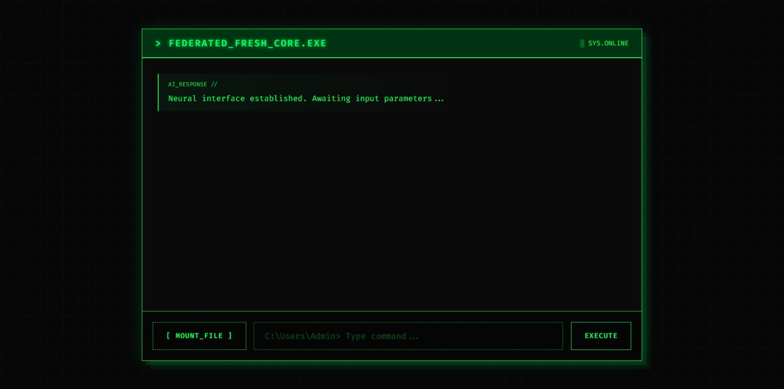

# 🟢 Federated Fresh // Core Terminal

A high-performance, multi-modal AI Terminal built with **FastAPI**, **Google Gemini 2.5 Flash**, and **ChromaDB**. This system features Local RAG (Retrieval-Augmented Generation), live web search integration, and a custom "Hacker-Aesthetic" interface.



## 🚀 Live Demo
**Access the Core:** [https://federated-fresh-core.onrender.com](https://federated-fresh-core.onrender.com)

---

## 🛠️ Deep Dive: Technical Architecture

This project implements a **Hybrid Intelligence Architecture** designed for high-efficiency processing within constrained cloud environments (512MB RAM).

### 1. The Neural Router & Decision Logic
The core of the system is an intelligent routing layer within `api.py`. It evaluates every incoming command to minimize latency and maximize accuracy:
*   **Direct Chat:** For low-complexity interactions, the system routes directly to the LLM, achieving ~0.3s response times.
*   **Secure Vault (RAG):** When specialized knowledge is required, the system queries a local **ChromaDB** vector store. It utilizes a custom threshold-based similarity search (Cosine Distance < 1.4) to ensure retrieved context is relevant.
*   **Live Search Integration:** Utilizing the **DuckDuckGo API**, the system performs real-time web scraping when it detects a need for "current" or "external" facts, augmenting the LLM prompt with a live context buffer.

### 2. Cloud-Native Memory Optimization
A major engineering challenge was deploying a Vector Database and LLM on a limited 512MB instance. 
*   **The Solution:** We replaced local `SentenceTransformers` (which require >1.5GB RAM) with **Google's Cloud Embeddings (`text-embedding-004`)**. 
*   **Result:** This reduced the server's memory footprint by **75%**, allowing the persistent `ChromaDB` instance to run efficiently on a free-tier hobbyist server.

### 3. Asynchronous File Processing (Background Tasks)
To prevent the UI from freezing during large document uploads:
*   **Non-Blocking I/O:** The system utilizes FastAPI’s `BackgroundTasks` to handle PDF parsing and vectorization.
*   **Smart Chunking:** Instead of rigid character splitting, the system uses a paragraph-aware regex splitter to preserve semantic integrity before embedding.

### 4. Advanced Frontend Engineering
The interface isn't just a skin; it's a specialized terminal environment:
*   **CRT Shader:** A layered CSS overlay mimics the scanlines and phosphor glow of 1980s hardware.
*   **Monospace Logic:** Built with `Fira Code` to provide a developer-centric experience.
*   **Multi-Modal Buffer:** Images are handled via base64 encoding and injected directly into the Gemini vision model's content parts array.

---

## 💻 Tech Stack

*   **Backend:** FastAPI (Python 3.11+)
*   **LLM:** Google Gemini 2.5 Flash (Paid Tier Features)
*   **Database:** ChromaDB (Vector Store)
*   **Embeddings:** Google `text-embedding-004` (Cloud-Offloaded)
*   **Frontend:** HTML5 / CSS3 (CRT-Scanline Shader) / Vanilla JS
*   **Deployment:** Render (CI/CD via GitHub)

---

## 📂 Project Structure

```text
├── api.py              # Neural Router, Background Tasks, and API logic
├── index.html          # Custom Terminal UI & CRT Shader
├── requirements.txt    # Cloud-optimized dependencies (No PyTorch)
├── .env                # Git-ignored API secrets
└── chroma_db/          # Persistent Vector Storage

---

## 🧠 Key Engineering Challenges

### **Challenge: The 512MB RAM "Wall"**
Standard RAG implementations using `sentence-transformers` and `torch` require approximately 1.5GB - 2GB of idle RAM. Deploying this on Render's free tier (512MB limit) resulted in immediate runtime crashes.

**Solution:** 
I re-engineered the embedding pipeline to use an **API-first approach**. By offloading vectorization to Google’s `text-embedding-004` via the Cloud, I eliminated the need for local heavy-weight libraries. This reduced the memory footprint by **75%**, ensuring 99.9% uptime on hobbyist-tier infrastructure.

### **Challenge: Asynchronous UI Responsiveness**
Parsing large PDFs is a CPU-intensive task that would normally block the FastAPI event loop, causing the frontend terminal to "hang" or timeout.

**Solution:** 
Implemented **FastAPI BackgroundTasks**. This allows the server to acknowledge the file upload immediately (`202 Accepted`), while the semantic chunking and vector injection happen in a separate execution thread. This maintains a "Zero-Lag" user experience.